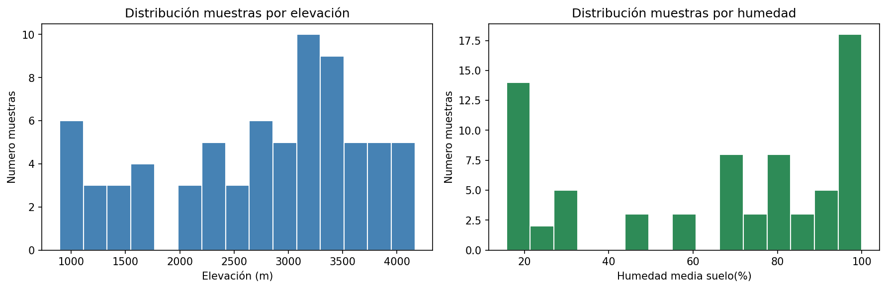
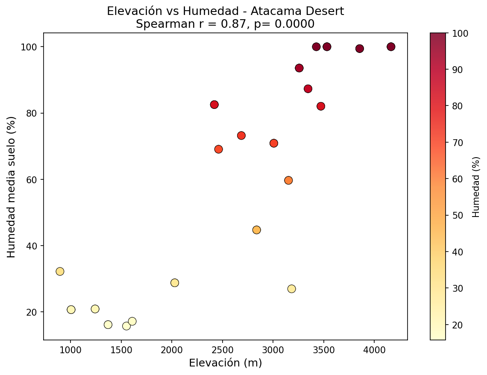

# Análisis del Microbioma del Suelo — Desierto de Atacama
Author: Leonardo Di Crisci Salvati

Este ha sido mi primer proyecto personal en el que intenté usar la programacción
para un análisis de datos ambientales reales.

Tengo formación en Ciencias Ambientales y quería empezar a entender 
cómo se utiliza python para trabajar con datos reales. Encontré el dataset 
de Neilson et al. 2017 en los tutoriales de QIIME 2 y me pareció 
interesante porque combina ecología microbiana con variables 
ambientales como la elevación y la humedad del suel.

## ¿Qué hace el proyecto?

- Carga el metadata real de 75 muestras de suelo del desierto de Atacama
- Limpia los datos eliminando muestras con valores faltantes
- Visualiza la distribución de muestras por elevación y humedad
- Calcula la correlación de Spearman entre elevación y humedad del suelo

## Resultado principal

Correlación de Spearman entre elevación y humedad: **r = 0.87, p < 0.0001**

A mayor elevación, mayor humedad del suelo. Este gradiente ambiental 
es el principal factor que estructura las comunidades microbianas 
descritas en el estudio original.

## Resultados





## Datos

Dataset público de QIIME 2:  
https://docs.qiime2.org/2024.10/tutorials/atacama-soils/

**Nota:** Este proyecto no replica el pipeline completo de QIIME 2. 
Usa únicamente el metadata ambiental del estudio para explorar 
la relación entre elevación y humedad del suelo con Python.

## Tecnologías

- Python 3.11
- pandas, numpy, matplotlib, seaborn, scipy

## Estructura

```
atacama-soil-microbiome/
├── data/raw/
│   └── sample_metadata.tsv
├── notebooks/
│   └── 01_analysis.ipynb
└── results/figures/
    ├── sample_distribution.png
    └── correlacion_elevacion_humedad.png
```
